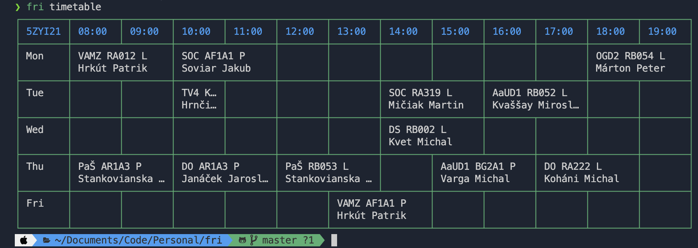

# FRI timetable & todo app

_timetable example after filling data_

## Motivation

Just another CLI app to store todos and show timetable. Data are stored in SQLite3 DB there in repo. Nothing safe but I wanted to do some server sync without much work.

## Tech stack

- Node.js
  - `yargs` - CLI argument parsing
  - `sqlite3` - database
  - `knes` - wrapper for databae
  - `cli-table3` - visualising table in CLI

## Installtion

1. clone this repo
2. install node.js & npm
3. `npm i -g .`
4. `fri <command>`

## Usage

1. add subjects
2. add teachers
3. add classes
4. create timetable with relation data

## ToDo

- refactor code: move non-db logic from file `db.js` into custom file in `commands` dir
- show which date & time is current
- add command for editing timetable
- implement ToDo's
- implement ToDo's into timetable (show asterisk to subject name if this subject has any active ToDo)
